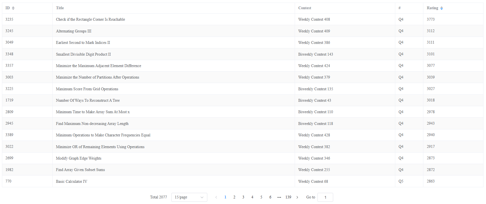
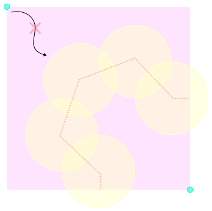

# LeetCode's Hardest Problem

This problem is rated as the **top most difficult question** on [LeetCode](https://leetcode.com/problems/check-if-the-rectangle-corner-is-reachable) by [zerotrac's rating](https://zerotrac.github.io/leetcode_problem_rating/).

## Check if the Rectangle Corner is Reachable

In fact, this question can be easily solved by BFS and simple geometry. We just need check if the circles can be connected together blocking all the path from origin to corner.

## Programming Languages

I've successfully tackled this problem in different programming languages, [Java](https://github.com/tommyinb/leetcode-hardest-problem-java), [TypeScript](https://github.com/tommyinb/leetcode-hardest-problem) and [C#](https://github.com/tommyinb/leetcode-hardest-problem-csharp).

If you want to learn more, I've created a interactive page for you. ✨  
Learn more 👉 <https://tommyinb.github.io/leetcode-hardest-problem/>

Or, Check out the code here 👉 [Solution.java](./Solution.java) 👈😊
Happy coding!
